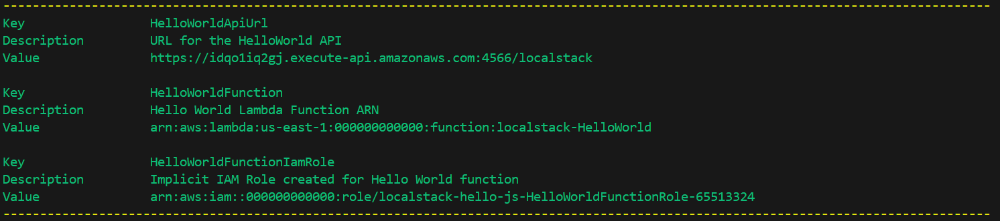

# SAM Hello World

This project demonstrates a simple AWS Lambda application using the AWS Serverless Application Model (SAM). It includes a basic "Hello, World!" function deployed locally using LocalStack.

## Features

- AWS Lambda function written in Javascript.
- Local development and testing with LocalStack.
- SAM template for easy deployment.
- A endpoint (base URL + resource path) to test the deployed lambda function

## Prerequisites

- [AWS CLI](https://docs.aws.amazon.com/cli/latest/userguide/getting-started-install.html): >= 2.24.11
- [Docker](https://www.docker.com/): >= 28.02
- [Localstack](https://localstack.cloud/): >= 4.3.0
- [Node.js](https://nodejs.org/en/download): v20.x.x
    - I recommend using [Node Version Manager](https://github.com/nvm-sh/nvm) for managing node versions.


## Setup

1. Clone the repository:
    ```bash
    git clone https://github.com/alfiomartini/localstack-hello-world.git`
    cd localstack-hello-world
    ```

2. Install dependencies:
    ```bash
    npm install
    ```
3. Configure profile `localstack`
    Add the following profile to your AWS configuration file (`~/.aws/config`):
    ```bash
    [profile localstack]
    region=us-east-1
    output=json
    endpoint_url=http://localhost:4566
    ```

    Add the following profile to your AWS credentials file (`~/.aws/credentials`):
    ```bash
    aws_access_key_id=test
    aws_secret_access_key=test
    ```
    4. Start LocalStack:
    ```bash
    localstack start -d
    ```

## Usage

### Build and deploy to Localstack
```bash
./deploy.sh localstack
```
 
You should get an output similar to this one:



### Test the endpoint in localstack

Assuming the output above,  send a request to the local endpoint. Note that the endpoint domain
was replaced so that the request to localstack executes successfully.

```bash
curl https://idqo1iq2gj.execute-api.localhost.localstack.cloud:4566/localstack/hello
```

### Verifying localstack health:
You can check all the available and running resources by making the following request:
```bash
 curl http://localhost.localstack.cloud:4566/_localstack/health
```
 You should get a response similar to this one:
 ```bash
 {
  "services": {
    "acm": "available",
    "apigateway": "running",
    "cloudformation": "running",
    "cloudwatch": "running",
    "config": "available",
    "dynamodb": "available",
    "dynamodbstreams": "available",
    "ec2": "available",
    "es": "available",
    "events": "available",
    "firehose": "available",
    "iam": "running",
    "kinesis": "available",
    "kms": "available",
    "lambda": "running",
    "logs": "running",
    "opensearch": "available",
    "redshift": "available",
    "resource-groups": "available",
    "resourcegroupstaggingapi": "available",
    "route53": "available",
    "route53resolver": "available",
    "s3": "running",
    "s3control": "available",
    "scheduler": "available",
    "secretsmanager": "available",
    "ses": "available",
    "sns": "available",
    "sqs": "available",
    "ssm": "available",
    "stepfunctions": "available",
    "sts": "running",
    "support": "available",
    "swf": "available",
    "transcribe": "available"
  },
  "edition": "community",
  "version": "4.3.1.dev26"
}
 ```
## Cleanup

1. To remove the deployed resources:
```bash
./delete.sh localstack
```
2. In case you want to stop localstack and remove the underlying running container:
```bash
localstack stop
```

## License

This project is licensed under the MIT License. See the [LICENSE](LICENSE) file for details.